<div align="center">

# 🎓 KNMIET Connect

### Secure Device-Bound Attendance Management Platform

*Modern attendance infrastructure built with FastAPI, PostgreSQL, Docker, and Progressive Web Technologies.*

<br>


---

### 🏫 Eliminate Proxy Attendance with Cryptographic Verification

*A backend-first attendance platform that combines authentication, device registration, role-based authorization, and rotating TOTP verification to make classroom attendance significantly harder to forge.*

---

</div>

# 📖 Overview

Traditional attendance systems depend on paper registers or static QR codes, both of which are vulnerable to proxy attendance and manual errors.

**KNMIET Connect** modernizes this workflow by introducing a layered verification system where attendance is tied not only to an authenticated user, but also to a registered device and a time-sensitive verification token.

Instead of trusting a single QR code, the system verifies **identity**, **authorization**, **device ownership**, **course enrollment**, and **time-based authentication** before recording attendance. The platform also centralizes attendance management for teachers and administrators through a secure REST API and PostgreSQL-backed data model.

---

# 🎯 The Problem

Universities commonly face several challenges with conventional attendance systems:

| ❌ Traditional Approach | ⚠️ Result |
|-------------------------|----------|
| Paper attendance sheets | Time consuming and prone to human error |
| Static QR Codes | Easy to photograph and share |
| No Device Verification | Friends can mark attendance for others |
| Manual Record Management | Difficult auditing and reporting |
| Weak Authentication | Increased risk of unauthorized access |

---

# 💡 The Solution

KNMIET Connect introduces multiple independent security layers before attendance is accepted.

```text
                    Student Login
                          │
                          ▼
                 JWT Authentication
                          │
                          ▼
                Role Verification (RBAC)
                          │
                          ▼
              Registered Device Validation
                          │
                          ▼
             Course Enrollment Validation
                          │
                          ▼
          Rotating 30-second TOTP Verification
                          │
                          ▼
             Attendance Recorded Securely
```

Every successful attendance record passes through each validation stage before it is committed to the database. This layered approach significantly reduces common forms of proxy attendance while maintaining a straightforward workflow for legitimate users.

---

# ✨ Core Highlights

| 🚀 Capability | Description |
|--------------|-------------|
| 🔐 Secure Authentication | JWT authentication with refresh token workflow |
| 👥 Role-Based Access Control | Separate capabilities for Students, Teachers, and Administrators |
| 📱 Device Registration | Attendance is linked to registered student devices |
| ⏱️ Dynamic TOTP Verification | Rotating verification codes reduce QR sharing abuse |
| 🗄️ PostgreSQL Backend | Relational schema with strong data integrity |
| ⚡ Async FastAPI | High-performance asynchronous REST API |
| 🐳 Docker Deployment | Containerized multi-service architecture |
| 🌐 Progressive Web App | Lightweight installable frontend experience |
| 📊 Attendance Reporting | Exportable attendance reports for administration |

---

# ⚙️ Technology Stack

<div align="center">

| Layer | Technologies |
|-------|--------------|
| **Frontend** | Vanilla JavaScript • HTML5 • CSS3 • Progressive Web App |
| **Backend** | FastAPI • Python • SQLAlchemy 2.0 |
| **Database** | PostgreSQL 16 |
| **Infrastructure** | Docker Compose • Nginx |
| **Authentication** | JWT • HttpOnly Cookies • Role-Based Access Control |
| **Security** | Bcrypt • TOTP • Device Binding |
| **Migrations** | Alembic |

</div>

---

# 🏛️ High-Level Architecture Preview

```text
                ┌────────────────────┐
                │     Browser/PWA    │
                └─────────┬──────────┘
                          │
                          ▼
                ┌────────────────────┐
                │       Nginx        │
                │ Reverse Proxy      │
                └─────────┬──────────┘
                          │
                          ▼
                ┌────────────────────┐
                │      FastAPI       │
                │ Business Logic     │
                └─────────┬──────────┘
                          │
                          ▼
                ┌────────────────────┐
                │   PostgreSQL 16    │
                │ Relational Storage │
                └────────────────────┘
```

> **In the next section:** we'll dive into the complete system architecture, request lifecycle, component interactions, and container networking with detailed Mermaid diagrams

---

# 🏗️ System Architecture

KNMIET Connect follows a **containerized three-tier architecture** designed around clear separation of responsibilities. Every layer performs a single responsibility, making the system easier to maintain, secure, and scale over time.

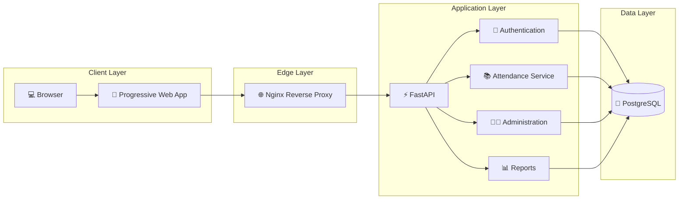

---

# 🧩 Architectural Layers

| Layer | Responsibility |
|--------|----------------|
| 💻 Client Layer | Provides the Progressive Web App used by students, teachers, and administrators. |
| 🌐 Edge Layer | Serves static assets, applies rate limiting, and forwards API requests. |
| ⚡ Application Layer | Implements business rules, authentication, attendance processing, reporting, and administration. |
| 🗄️ Data Layer | Stores users, attendance records, sessions, courses, enrollments, audit logs, and authentication data. |

---

# 🔄 Request Lifecycle

Every API request follows a predictable processing pipeline.

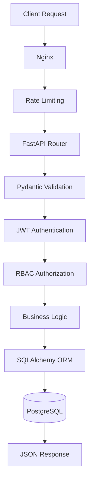

Each stage has a dedicated responsibility.

| Step | Purpose |
|------|----------|
| 🌐 Nginx | Receives incoming requests and serves static assets. |
| 🚦 Rate Limiting | Prevents abuse of sensitive endpoints such as authentication. |
| 📥 Validation | Ensures request payloads conform to expected schemas. |
| 🔐 Authentication | Verifies the user's identity using JWT credentials. |
| 👥 Authorization | Confirms the user has permission to access the requested resource. |
| ⚙️ Business Logic | Executes attendance, authentication, or administrative operations. |
| 🗄️ Database | Persists validated data using PostgreSQL. |

---

# 📦 Container Architecture

The application is fully containerized using Docker Compose.

```text
                        Docker Compose
                               │
      ┌────────────────────────┼────────────────────────┐
      │                        │                        │
      ▼                        ▼                        ▼
 ┌────────────┐         ┌─────────────┐         ┌─────────────┐
 │   Nginx    │────────▶│   FastAPI   │────────▶│ PostgreSQL  │
 └────────────┘         └─────────────┘         └─────────────┘
      │
      ▼
 Progressive Web App
```

This architecture isolates each service while allowing them to communicate over Docker's internal network. The database remains inaccessible from the public internet, reducing the attack surface.

---

# 🛠️ Component Responsibilities

## 🌐 Progressive Web App

The frontend is intentionally lightweight.

### Responsibilities

- User authentication
- Attendance scanning
- Session creation
- Attendance history
- Offline asset caching
- Device interaction

---

## 🚦 Nginx

Acts as the gateway to the application.

Responsibilities include:

- Reverse proxy
- Static asset hosting
- Security headers
- Request forwarding
- Rate limiting
- API routing

```text
Browser
   │
   ▼
Nginx
   │
   ├──── Static Files
   │
   └──── /api/*
           │
           ▼
        FastAPI
```

---

## ⚡ FastAPI Backend

The backend contains all business rules.

Major modules include:

```
Authentication

Attendance Engine

Administration

Reporting

Validation

Security

Database Access
```

Its responsibilities include:

- JWT authentication
- Session management
- Attendance validation
- Device registration
- Course enrollment checks
- Report generation
- Audit logging

---

## 🐘 PostgreSQL

The relational database stores the entire institutional data model.

It manages:

- Users
- Students
- Teachers
- Departments
- Courses
- Enrollments
- Attendance Sessions
- Attendance_Logs
- Refresh_Tokens
- Device_Registrations
- Audit Tables

Strong relational constraints help maintain data consistency while preventing duplicate attendance records and invalid relationships.

---

# ⚙️ Why This Architecture?

```text
Presentation Layer
        │
        ▼
Business Logic
        │
        ▼
Persistence Layer
```

Separating concerns provides several advantages.

| Benefit | Why it Matters |
|---------|----------------|
| 🧩 Modular Design | Components can evolve independently. |
| 🔒 Security | Sensitive logic remains isolated inside the backend. |
| 📈 Scalability | Individual services can be optimized without redesigning the application. |
| 🛠️ Maintainability | Easier debugging, testing, and future feature development. |
| 🔄 Extensibility | New modules can be integrated with minimal changes to existing code. |

---

> **Next:** We'll explore the authentication architecture, JWT lifecycle, role-based access control, refresh token flow, and the multi-layer security model that protects every attendance request.

---

# 🔐 Authentication & Security Architecture

Security is the foundation of KNMIET Connect.

Instead of relying on a single authentication mechanism, every attendance request passes through **multiple independent security layers** before it is accepted.

```text
               User Login
                    │
                    ▼
        Email & Password Verification
                    │
                    ▼
         JWT Access Token Issued
                    │
                    ▼
      HttpOnly Refresh Cookie Stored
                    │
                    ▼
          Authenticated API Access
                    │
                    ▼
        Role-Based Authorization
                    │
                    ▼
      Device Ownership Verification
                    │
                    ▼
        Course Enrollment Check
                    │
                    ▼
      Time-Based TOTP Verification
                    │
                    ▼
       Attendance Successfully Stored
```

This layered approach significantly reduces the possibility of unauthorized attendance while maintaining a simple user experience.

---

# 🔑 Authentication Flow

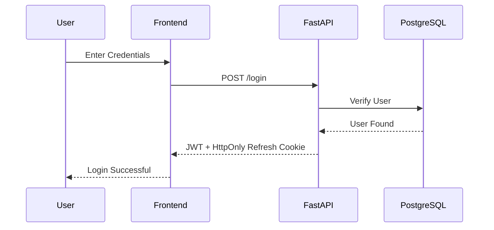

---

# 🔄 Session Lifecycle

Once authenticated, every request follows a secure verification path.

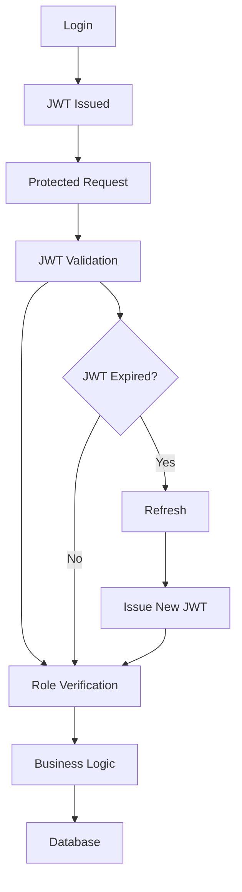

---

# 🪪 Role-Based Access Control

Different users interact with different parts of the platform.

```text
                     USERS
                        │
      ┌─────────────────┼─────────────────┐
      │                 │                 │
      ▼                 ▼                 ▼

👨🎓 Student      👨🏫 Teacher      👨💼 Administrator
```

---

## 👨🎓 Student

Permissions

- Login
- Register Device
- Scan Attendance QR
- View Attendance History

---

## 👨🏫 Teacher

Permissions

- Login
- Create Sessions
- Generate QR Codes
- End Sessions
- View Attendance

---

## 👨💼 Administrator

Permissions

- Manage Users
- Create Courses
- Assign Teachers
- Assign Students
- Import CSV
- Export Reports

---

## RBAC Decision Flow

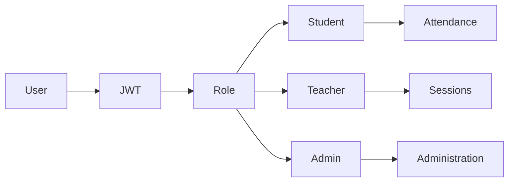

---

# 📱 Device Registration

One of the primary goals of KNMIET Connect is reducing **proxy attendance**.

Instead of trusting only the student's login credentials, the system also associates attendance with a registered device.

```text
Student Account
       │
       ▼
Device Registration
       │
       ▼
Device Fingerprint Stored
       │
       ▼
Attendance Request
       │
       ▼
Device Match?
       │
 ┌─────┴─────┐
 │           │
 ▼           ▼

YES         NO

 │           │

 ▼           ▼

Continue    Reject
```

This additional verification layer makes it significantly more difficult for another student to mark attendance using shared credentials.

---

# ⏱️ TOTP Verification

Unlike static QR codes, the platform generates **rotating Time-Based One-Time Passwords (TOTP)** for each attendance session.

```text
Teacher Starts Session
          │
          ▼
Generate Secret
          │
          ▼
Encrypt Secret
          │
          ▼
Generate TOTP
          │
          ▼
Display QR Code
          │
          ▼
Student Scans QR
          │
          ▼
Backend Validates Time Window
          │
          ▼
Attendance Accepted
```

Because the verification code changes periodically, previously captured QR codes quickly become invalid.

---

# 🛡️ Security Layers

| Layer | Purpose |
|--------|----------|
| 🔑 JWT Authentication | Verifies user identity |
| 🍪 Refresh Cookies | Maintains secure sessions |
| 👥 Role-Based Access | Restricts endpoint access |
| 📱 Device Registration | Prevents unauthorized devices |
| 🎓 Enrollment Validation | Confirms student-course mapping |
| ⏱️ TOTP Verification | Confirms real-time classroom participation |
| 🗄️ PostgreSQL Constraints | Protects relational integrity |
| 📝 Audit Logging | Tracks important database changes |

---

# 🧠 Defense in Depth

Rather than trusting a single security mechanism, KNMIET Connect combines multiple layers.

```text
Login
 │
 ▼
JWT
 │
 ▼
RBAC
 │
 ▼
Registered Device
 │
 ▼
Enrollment
 │
 ▼
Valid TOTP
 │
 ▼
Database Constraints
 │
 ▼
Attendance Recorded
```

An attacker would need to bypass every validation stage, not just one, before an attendance record could be created.

---

# 🔍 Authentication at a Glance

| Feature | Purpose |
|----------|---------|
| JWT Access Tokens | Authenticate API requests |
| Refresh Token Rotation | Maintain secure user sessions |
| HttpOnly Cookies | Reduce client-side token exposure |
| Role-Based Authorization | Enforce least-privilege access |
| Device Registration | Bind attendance to a known device |
| TOTP Verification | Validate real-time attendance |
| Audit Logging | Preserve accountability |

---

> **Next Chapter:** We'll dive into the heart of the platform: the **Attendance Engine**, including session creation, QR generation, attendance scanning, validation pipeline, and complete end-to-end request flow.

---

# ⚙️ Attendance Engine

The Attendance Engine is the core of KNMIET Connect.

Its responsibility is simple:

> Ensure that only an authenticated, authorized, enrolled student using a registered device can successfully mark attendance during an active class session.

Every attendance request passes through a controlled validation pipeline before reaching the database.

---

# 🎯 Attendance Lifecycle

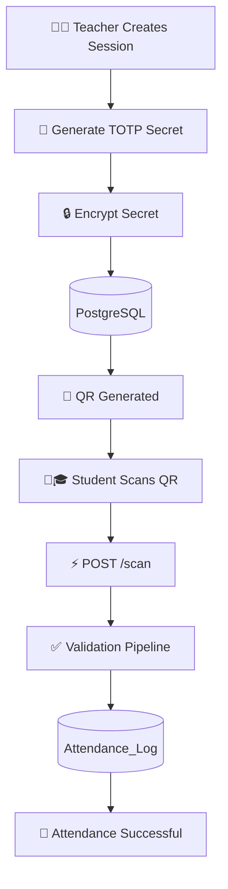

---

# 🚀 End-to-End Workflow

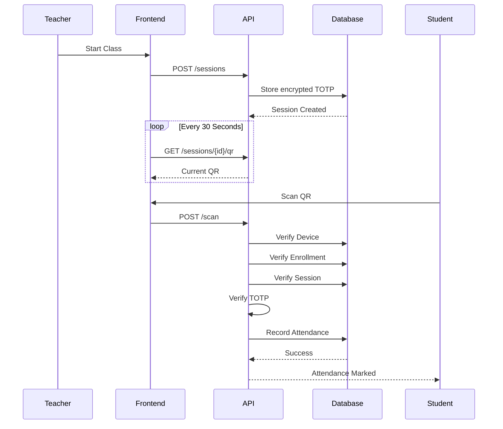

---

# 📖 Step 1

## Teacher Starts a Session

The instructor initiates attendance for a specific course.

```http
POST /sessions
```

Backend responsibilities

```
✔ Validate Teacher JWT

✔ Verify Teacher Role

✔ Verify Assigned Course

✔ Generate Session

✔ Generate TOTP Secret

✔ Encrypt Secret

✔ Store Session
```

Result

```
Class Session Created
```

---

# 📖 Step 2

## QR Generation

Once a session exists, students don't immediately receive attendance.

Instead, the backend continuously generates a rotating QR code.

```text
Encrypted Secret

↓

Current Timestamp

↓

Generate TOTP

↓

Encode QR

↓

Display on Teacher Screen
```

Unlike static QR codes, every code expires after a short interval.

---

# 📖 Step 3

## Student Scan

Student workflow

```text
Open PWA

↓

Login

↓

Open Scanner

↓

Scan QR

↓

POST /scan

↓

Wait for Verification
```

The scan itself does **not** mark attendance.

It only starts the verification process.

---

# 🔍 Validation Pipeline

This is the heart of the Attendance Engine.

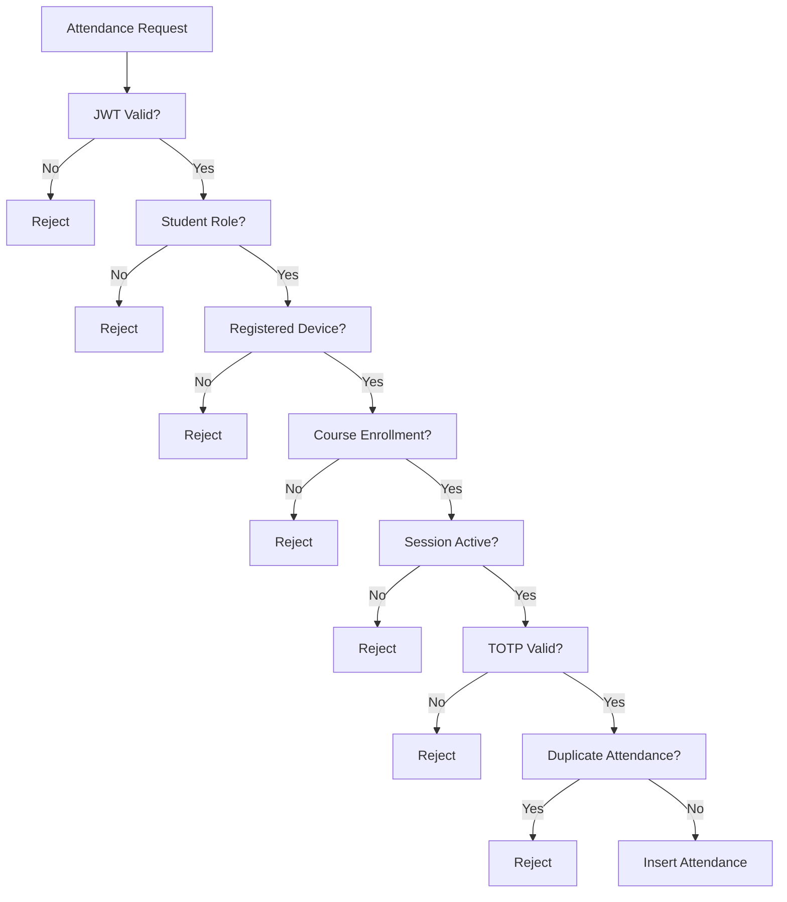

Only if **every validation succeeds** does the request proceed to the database.

---

# 🔐 Validation Checklist

| Validation | Purpose |
|------------|----------|
| 🔑 JWT Authentication | Confirms user identity |
| 👥 Role Verification | Confirms the requester is a student |
| 📱 Device Registration | Ensures attendance originates from the registered device |
| 🎓 Enrollment Check | Verifies the student belongs to the course |
| 📚 Session Status | Prevents attendance after class has ended |
| ⏱️ TOTP Validation | Confirms QR freshness |
| 🚫 Duplicate Check | Prevents multiple submissions |

---

# 📦 Database Transaction

Once validation completes, the backend performs a database transaction.

```text
Attendance Request

↓

SQLAlchemy

↓

Transaction Starts

↓

Insert attendance_logs

↓

Commit

↓

Success Response
```

If any validation fails before the transaction completes,

```
Rollback

↓

Error Response
```

No partial attendance records are created.

---

# 📊 Attendance Request Timeline

```text
Teacher Creates Session
          │
          ▼
QR Displayed
          │
          ▼
Student Scans
          │
          ▼
Backend Validation
          │
          ▼
Database Commit
          │
          ▼
Attendance History Updated
```

---

# ⚡ Why This Design?

Instead of relying on a single QR scan,

KNMIET Connect validates multiple independent conditions.

```text
Identity

+

Authorization

+

Registered Device

+

Enrollment

+

Active Session

+

Valid TOTP

=

Attendance
```

Each layer eliminates an entire class of invalid attendance attempts.

---

# 🏁 Attendance Engine Summary

| Stage | Responsibility |
|--------|----------------|
| 👨🏫 Session Creation | Initializes attendance window |
| 🔐 Secret Generation | Creates cryptographic session secret |
| 📱 QR Generation | Produces rotating attendance QR |
| 👨🎓 Student Scan | Starts attendance workflow |
| ⚡ Validation Engine | Verifies seven independent conditions |
| 🗄️ Database Commit | Stores attendance permanently |
| 📈 History Update | Makes attendance available for reporting |

---

> **Next Chapter:** We'll explore the **Database Architecture**, including the complete PostgreSQL schema, entity relationships, foreign keys, audit tables, indexes, and data integrity mechanisms.

---

# 🗄️ Database Architecture

At the heart of KNMIET Connect lies a relational PostgreSQL database designed to maintain data integrity, enforce relationships, and support secure attendance operations.

Instead of storing isolated documents, the system models the academic environment through interconnected entities representing users, departments, courses, attendance sessions, and attendance records.

---

# 🏛️ Database Overview

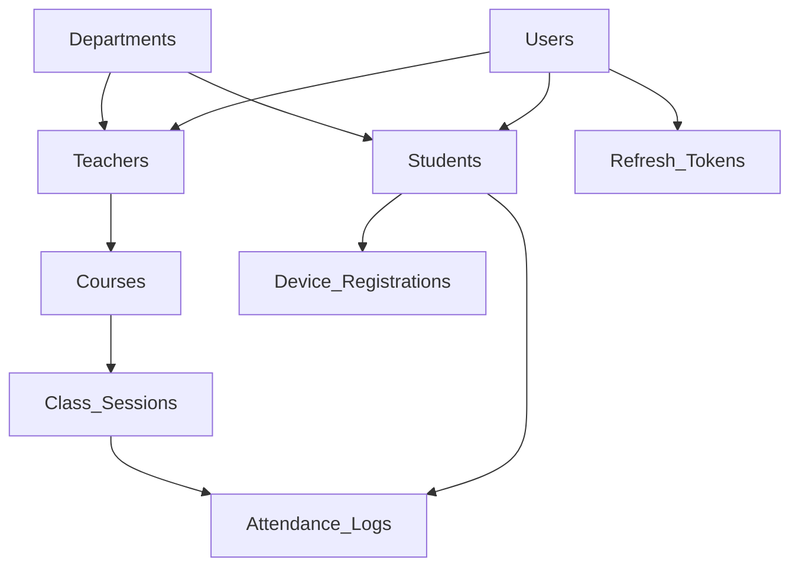

---

# 📊 Complete Entity Relationship Diagram

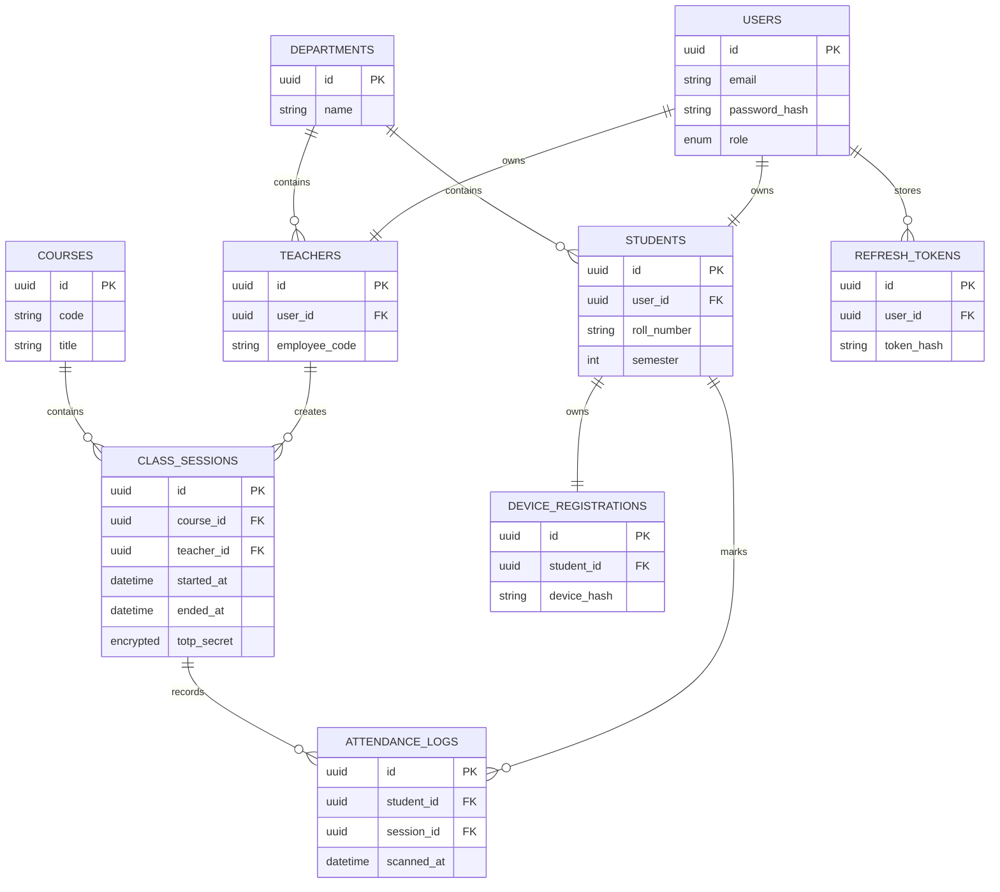

---

# 📚 Academic Hierarchy

```text
University

│

├──────── Departments

│          │

│          ├──── Teachers

│          │

│          └──── Students

│

└──────── Courses

             │

             ▼

      Attendance Sessions

             │

             ▼

      Attendance_Logs
```

---

# 👤 Users

The Users table acts as the authentication foundation.

Every authenticated account begins here.

```text
Users

│

├── Student

├── Teacher

└── Administrator
```

Stores

- Email
- Password Hash
- Role
- Account Metadata

Authentication never depends directly on the Student or Teacher tables.

---

# 🎓 Students

Contains academic information.

```
Student

↓

Department

↓

Semester

↓

Roll Number

↓

Registered Device

↓

Attendance History
```

Responsibilities

- Attendance ownership
- Device registration
- Course enrollment
- Academic identity

---

# 👨🏫 Teachers

Teachers own attendance sessions.

```text
Teacher

↓

Assigned Courses

↓

Create Sessions

↓

Generate QR

↓

View Attendance
```

---

# 📖 Courses

Each course becomes the parent of multiple attendance sessions.

```text
Course

│

├── Session 1

├── Session 2

├── Session 3

└── Session N
```

---

# 🕒 Class_Sessions

A session represents one active lecture.

```
Teacher

↓

Create Session

↓

Encrypted Secret

↓

Start Time

↓

End Time

↓

Active QR
```

Every attendance scan belongs to exactly one session.

---

# 📝 Attendance_Logs

Attendance logs are the permanent academic record.

```text
Student

+

Session

↓

Attendance Record

↓

Timestamp

↓

Stored
```

Each record represents

```
One Student

One Session

One Attendance
```

---

# 📱 Device Registration

Every student owns one registered device.

```text
Student

↓

Register Device

↓

Generate Hash

↓

Store

↓

Future Verification
```

During attendance,

```
Attendance Request

↓

Device Hash

↓

Compare

↓

Match?

↓

Continue
```

---

# 🔄 Refresh_Tokens

Refresh tokens extend authenticated sessions.

```text
Login

↓

Issue Refresh Token

↓

Hash

↓

Store

↓

Rotate

↓

Expire
```

Only hashed tokens are stored in the database, reducing the impact of database compromise.

---

# 🔗 Relationship Overview

```text
Users

├──── Students

│       │

│       ├──── Attendance_Logs

│       │

│       └──── Device Registration

│

└──── Teachers

        │

        └──── Class_Sessions

                │

                ▼

        Attendance_Logs
```

---

# 🛡️ Database Constraints

Relational integrity is enforced using foreign keys and unique constraints.

Examples include

```
Student must exist

↓

Teacher must exist

↓

Course must exist

↓

Session must exist

↓

Attendance may be inserted
```

Duplicate attendance records are prevented through a composite uniqueness constraint on the attendance log.

---

# 📈 Data Flow

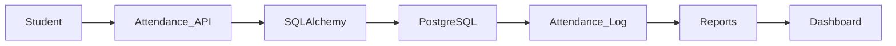

---

# 🧱 Database Design Philosophy

The schema follows classic relational design principles.

| Principle | Benefit |
|-----------|----------|
| 🔗 Foreign Keys | Prevent orphan records |
| 🔒 Constraints | Preserve consistency |
| 📚 Normalization | Reduce redundant data |
| ⚡ Indexes | Improve query performance |
| 🛡️ Audit Tables | Preserve historical changes |
| 🔄 Transactions | Ensure atomic attendance operations |

---

# 📊 Database Summary

| Entity | Responsibility |
|---------|----------------|
| 👤 Users | Authentication and identity |
| 🎓 Students | Academic profiles |
| 👨🏫 Teachers | Session ownership |
| 🏫 Departments | Academic organization |
| 📚 Courses | Subject management |
| 🕒 Class_Sessions | Attendance windows |
| 📝 Attendance_Logs | Permanent attendance records |
| 📱 Device_Registrations | Device ownership verification |
| 🔄 Refresh_Tokens | Secure session continuation |
| 📖 Audit Tables | Database change history |

---

> **Next Chapter:** We'll explore the **REST API Design**, including endpoint groups, request flow, authentication middleware, response formats, and API architecture.

---

# 🌐 REST API Architecture

KNMIET Connect exposes a RESTful API built with **FastAPI**, where each endpoint is organized around a specific domain.

Rather than placing all functionality into a single controller, the API is divided into independent modules responsible for authentication, attendance, administration, reporting, and system health.

---

# 🏗 API Architecture

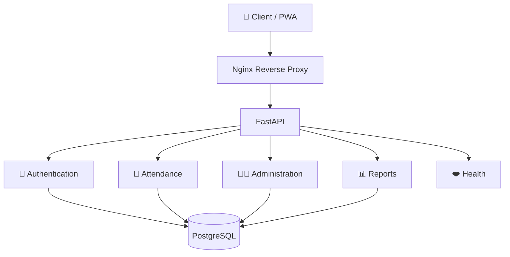

---

# 🚦 Request Pipeline

Every request follows exactly the same lifecycle.

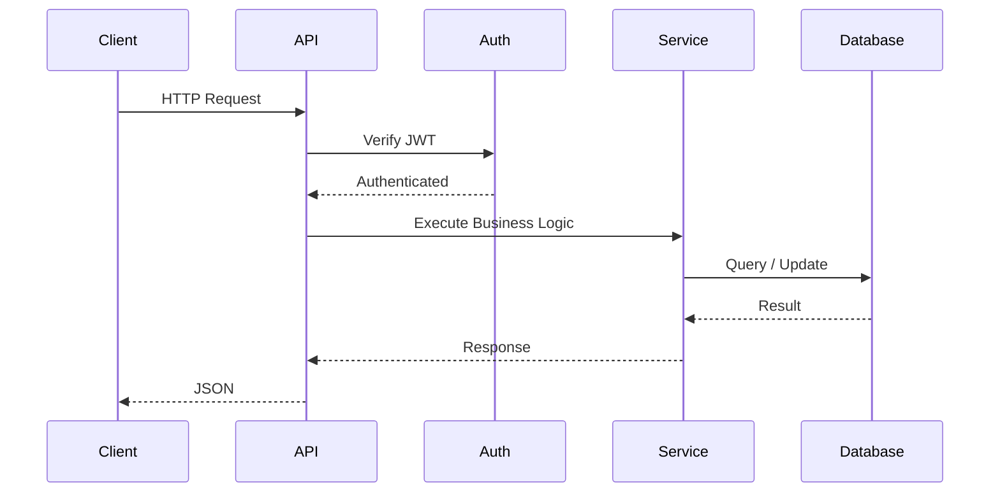

---

# 📂 API Organization

```
/api

├── Authentication

├── Attendance

├── Administration

├── Reporting

└── Health
```

Each module owns a specific responsibility, making the codebase easier to maintain and extend.

---

# 🔐 Authentication API

Handles user identity and session management.

| Method | Endpoint | Purpose |
|---------|----------|---------|
| POST | `/login` | Authenticate user |
| POST | `/logout` | End current session |
| POST | `/refresh` | Issue new access token |
| POST | `/register` | Register account |

Authentication endpoints are responsible only for identity verification and token management.

---

# 👨🎓 Attendance_API

The Attendance module powers the core functionality of the platform.

| Method | Endpoint | Purpose |
|---------|----------|---------|
| POST | `/devices/register` | Register student device |
| POST | `/sessions` | Create attendance session |
| GET | `/sessions/{id}/qr` | Retrieve active QR |
| POST | `/sessions/{id}/end` | End attendance session |
| POST | `/scan` | Submit attendance |
| GET | `/me` | Retrieve attendance history |

These endpoints manage the complete attendance lifecycle from session creation to attendance recording.

---

# 👨💼 Administration API

Administrative endpoints manage institutional data.

```text
Administrator

│

├── Users

├── Departments

├── Courses

├── Teacher Assignment

├── Student Enrollment

└── CSV Import
```

| Method | Purpose |
|----------|---------|
| Create Departments | Academic organization |
| Create Courses | Subject management |
| Assign Teachers | Course ownership |
| Assign Students | Enrollment |
| Import CSV | Bulk onboarding |
| Export Reports | Attendance analytics |

---

# 📊 Reporting API

Reporting endpoints provide institutional insights.

```
Attendance_Logs

↓

Aggregate Data

↓

Generate CSV

↓

Download
```

Designed for

- Teachers
- Administrators
- Academic Records

---

# ❤️ Health API

Infrastructure monitoring endpoints.

```
Docker

↓

Health Endpoint

↓

Application Status

↓

Ready
```

Example endpoints

```
/health/live

/health/ready

/metrics
```

These endpoints help container orchestration platforms determine whether the application is healthy and ready to receive traffic.

---

# 📥 Example Request

### Login

```http
POST /api/login
Content-Type: application/json

{
    "email": "teacher@college.edu",
    "password": "********"
}
```

---

### Successful Response

```json
{
    "access_token": "...",
    "token_type": "Bearer"
}
```

An HttpOnly refresh cookie is also issued for secure session continuation.

---

# 📥 Example Attendance Request

```http
POST /api/scan
Authorization: Bearer <JWT>
```

```json
{
    "session_id":"...",
    "totp":"123456",
    "device_token":"..."
}
```

---

### Successful Response

```json
{
    "success": true,
    "message": "Attendance recorded successfully."
}
```

---

# 🚨 Error Handling

The API communicates failures using standard HTTP status codes.

| Status | Meaning |
|---------|----------|
| ✅ 200 | Successful request |
| 🆕 201 | Resource created |
| ❌ 400 | Invalid request |
| 🔐 401 | Authentication required |
| ⛔ 403 | Permission denied |
| 🔍 404 | Resource not found |
| ⚠️ 409 | Duplicate or conflicting request |
| 💥 500 | Internal server error |

---

# 🔒 Middleware Pipeline

Before any endpoint executes, the request travels through multiple middleware layers.

```text
Incoming Request

↓

CORS

↓

Request Validation

↓

JWT Authentication

↓

Role Verification

↓

Business Logic

↓

Database

↓

JSON Response
```

This consistent pipeline keeps endpoint implementations focused on business logic rather than repeating security checks.

---

# 📡 API Design Principles

| Principle | Why |
|------------|-----|
| 🌐 RESTful Routing | Predictable resource organization |
| 📦 JSON Payloads | Platform-independent communication |
| 🔐 Stateless Authentication | Scalable request processing |
| ⚡ Async FastAPI | High concurrency for I/O workloads |
| 🧩 Modular Routers | Easier maintenance and extension |
| 📝 Automatic Validation | Strong request schema enforcement |

---

# 🎯 API Summary

```text
Authentication

↓

Attendance

↓

Administration

↓

Reporting

↓

Health Monitoring
```

Each module performs one well-defined responsibility, resulting in a clean, modular API that is straightforward to maintain and extend as the platform evolves.

---

> **Next Chapter:** We'll examine the **Infrastructure & Deployment** architecture, covering Docker Compose, container networking, Nginx, project structure, local setup, and deployment workflow.

---

# 🚀 Infrastructure & Deployment

KNMIET Connect is designed as a **containerized multi-service application**, where each component runs independently while communicating through Docker's internal network.

Rather than installing databases, web servers, and Python dependencies manually, the project uses **Docker Compose** to provide a reproducible development environment.

---

# 🏗 Infrastructure Overview

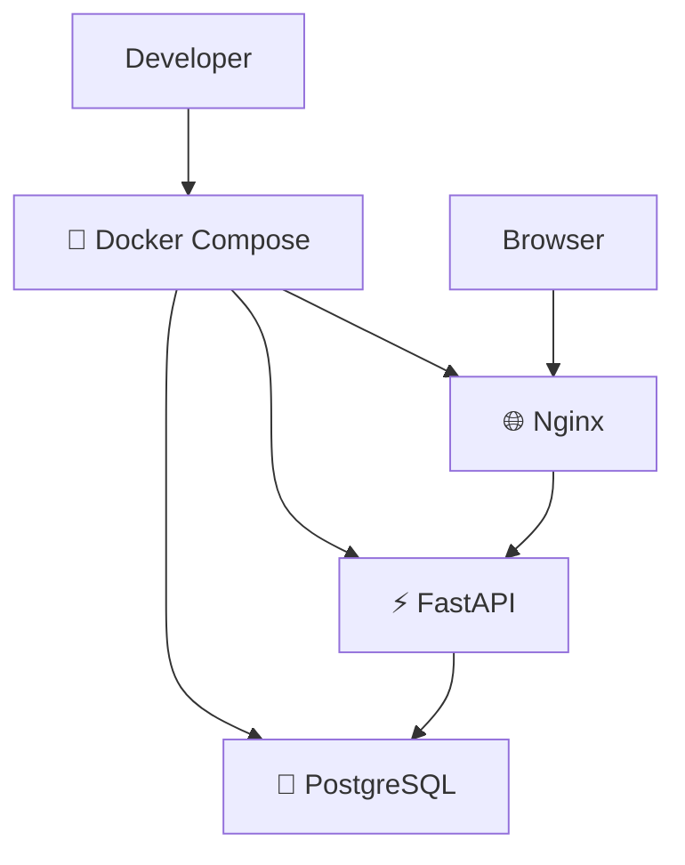

---

# 📦 Container Architecture

```text
                    Docker Host

┌──────────────────────────────────────────────────┐

        Docker Compose Network

┌──────────┐

│  Nginx   │

└────┬─────┘

     │

     ▼

┌──────────────┐

│   FastAPI    │

└──────┬───────┘

       │

       ▼

┌──────────────┐

│ PostgreSQL   │

└──────────────┘

└──────────────────────────────────────────────────┘
```

Every service performs one dedicated responsibility, resulting in a clean and maintainable deployment architecture.

---

# 🌐 Nginx

Nginx acts as the single public entry point.

```text
Browser

↓

Nginx

├──── Static Files

└──── /api

↓

FastAPI
```

Responsibilities include

- Reverse Proxy
- Static File Hosting
- Request Routing
- Rate Limiting
- Security Boundary

The backend remains hidden behind the reverse proxy, reducing unnecessary direct exposure.

---

# ⚡ FastAPI Service

The application server is responsible for executing all business logic.

```text
Incoming Request

↓

Authentication

↓

Validation

↓

Attendance Engine

↓

Database Access

↓

JSON Response
```

Responsibilities

- Authentication
- Authorization
- Attendance
- Administration
- Reporting
- Database Operations

---

# 🐘 PostgreSQL

The database container stores all persistent application data.

```
Users

Students

Teachers

Courses

Sessions

Attendance

Refresh_Tokens

Devices

Audit Logs
```

PostgreSQL remains on the internal Docker network and is intentionally not exposed publicly.

---

# 🔄 Request Journey

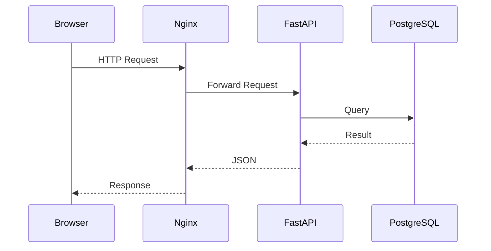

---

# 📂 Project Structure

```text
knmiet-connect/

├── backend/
│   ├── api/
│   ├── core/
│   ├── models/
│   ├── schemas/
│   ├── services/
│   ├── migrations/
│   └── tests/
│
├── frontend/
│   ├── css/
│   ├── js/
│   ├── images/
│   ├── service-worker.js
│   └── index.html
│
├── nginx/
│   └── nginx.conf
│
├── docker-compose.yml
│
├── .env.example
│
└── README.md
```

---

# ⚙️ Development Workflow

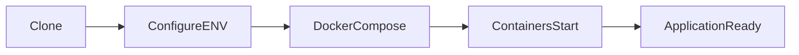

---

# 🛠 Local Installation

### Clone Repository

```bash
git clone https://github.com/<username>/knmiet-connect.git

cd knmiet-connect
```

---

### Configure Environment

```bash
cp .env.example .env
```

Update values inside

```
Database URL

JWT Secret

Fernet Key

Environment Variables
```

---

### Start Containers

```bash
docker compose up --build
```

Docker Compose automatically starts

```
Nginx

FastAPI

PostgreSQL
```

---

# 🌍 Service Communication

```text
Browser

↓

Port 8080

↓

Nginx

↓

Internal Docker Network

↓

FastAPI

↓

Internal Docker Network

↓

PostgreSQL
```

Application traffic never communicates directly with PostgreSQL.

---

# 📁 Volume Layout

```text
Docker

├── PostgreSQL Volume

├── Backend Source

├── Frontend Assets

└── Nginx Configuration
```

Persistent database storage survives container restarts.

---

# 🔐 Deployment Considerations

Current architecture supports

✅ Docker Compose

Future improvements could include

- HTTPS (TLS termination)
- Reverse proxy hardening
- Cloud deployment
- Container orchestration
- Automated CI/CD
- Monitoring and logging

The current audit notes that enabling HTTPS and improving bulk CSV processing are the main steps before a production deployment.

---

# 📊 Infrastructure Summary

| Component | Responsibility |
|------------|----------------|
| 🌐 Nginx | Reverse proxy & static assets |
| ⚡ FastAPI | Business logic |
| 🐘 PostgreSQL | Persistent relational database |
| 🐳 Docker Compose | Service orchestration |
| 📱 PWA | Client interface |

---

# 🧠 Why Docker?

```text
Same Environment

↓

Same Dependencies

↓

Same Containers

↓

Runs Everywhere
```

Using Docker eliminates "works on my machine" problems by ensuring every developer runs the application inside an identical environment.

---

> **Next Chapter:** We'll cover **Engineering Decisions, Performance, Security Design Choices, Known Limitations, Roadmap, and conclude the README with polished finishing sections.**

---

# ⚖️ Engineering Decisions

Every major technology in KNMIET Connect was selected to solve a specific engineering problem rather than simply following popular trends.

The architecture prioritizes **clarity, maintainability, security, and predictable behavior** over unnecessary complexity.

---

# 🧠 Design Philosophy

```text
Simple

↓

Secure

↓

Maintainable

↓

Scalable

↓

Reliable
```

Instead of building a distributed system with dozens of services, KNMIET Connect keeps related functionality together inside a clean, modular backend.

---

# 🏛 Why FastAPI?

```text
HTTP Request

↓

Async FastAPI

↓

Business Logic

↓

Database

↓

JSON Response
```

### Why FastAPI?

| Benefit | Reason |
|----------|--------|
| ⚡ Async Architecture | Efficient handling of concurrent I/O operations |
| 📄 Automatic OpenAPI Docs | Built-in API documentation |
| 🧩 Dependency Injection | Clean authentication and authorization |
| ✅ Pydantic Validation | Strong request validation |
| 🚀 High Performance | Excellent throughput with minimal overhead |

FastAPI provides a lightweight yet powerful foundation for backend APIs while keeping the codebase organized.

---

# 🐘 Why PostgreSQL?

Attendance data is highly relational.

```text
Students

↓

Courses

↓

Sessions

↓

Attendance

↓

Reports
```

A relational database naturally models these relationships.

| PostgreSQL Feature | Benefit |
|-------------------|----------|
| 🔗 Foreign Keys | Relationship integrity |
| 🛡 Constraints | Prevent invalid data |
| 🔄 Transactions | Atomic attendance operations |
| 📊 Powerful Queries | Reporting & analytics |
| 📜 Audit Support | Historical tracking |

---

# ⚙️ Why SQLAlchemy?

```text
Python Objects

↓

SQLAlchemy ORM

↓

SQL Queries

↓

PostgreSQL
```

Benefits

- Cleaner code
- Database abstraction
- Type safety
- Easier maintenance
- Migration compatibility

---

# 🧱 Why Docker?

```text
Developer A

↓

Docker

↓

Same Environment

↓

Developer B
```

Instead of manually installing dependencies,

every developer runs the exact same environment.

Benefits

- Consistent setup
- Isolated services
- Easy onboarding
- Reproducible environments

---

# 🌐 Why Nginx?

Nginx acts as the application's gateway.

```text
Internet

↓

Nginx

↓

FastAPI
```

Responsibilities

```
Reverse Proxy

Static Assets

Routing

Rate Limiting

Security Boundary
```

Keeping FastAPI behind Nginx reduces unnecessary exposure and centralizes request handling.

---

# 💡 Why a Progressive Web App?

Instead of requiring a native Android application,

the project uses a Progressive Web App.

```text
Browser

↓

Install

↓

Offline Assets

↓

Native-like Experience
```

Advantages

- No Play Store deployment
- Lightweight
- Cross-platform
- Easy updates
- Simple installation

---

# 📐 Architectural Principles

```text
Single Responsibility

↓

Loose Coupling

↓

High Cohesion

↓

Layer Separation

↓

Dependency Isolation
```

Each layer focuses on one responsibility.

| Layer | Responsibility |
|--------|----------------|
| 🌐 Frontend | User interaction |
| ⚡ Backend | Business logic |
| 🗄 Database | Persistent storage |
| 🌍 Nginx | Request routing |

---

# 🔒 Security Philosophy

Rather than trusting users,

the backend validates every important action.

```text
Request

↓

Authenticate

↓

Authorize

↓

Validate

↓

Verify Device

↓

Verify Session

↓

Verify TOTP

↓

Store
```

Security is treated as a pipeline instead of a single checkpoint.

---

# 📈 Scalability Strategy

Current architecture

```text
PWA

↓

Nginx

↓

FastAPI

↓

PostgreSQL
```

Future growth can be achieved by

```
Load Balancer

↓

Multiple FastAPI Instances

↓

Shared PostgreSQL

↓

Caching Layer
```

The modular architecture allows components to evolve independently without requiring a complete redesign.

---

# ⚠️ Known Limitations

Every software project has trade-offs.

Current limitations include:

| Limitation | Impact |
|------------|--------|
| 🌐 No HTTPS configuration | Suitable for development, requires TLS before internet deployment |
| 📦 Synchronous CSV imports | Large imports may increase request processing time |
| 🖥 Frontend still evolving | Some UI workflows need refinement |
| 📧 No password recovery | Account recovery is not yet implemented |

These are acknowledged improvements rather than hidden shortcomings, reflecting the current state of the project.

---

# 🛣️ Future Roadmap

```text
Current

↓

HTTPS

↓

Password Reset

↓

Async CSV Processing

↓

Monitoring

↓

Cloud Deployment
```

### Planned Improvements

- 🔐 HTTPS with TLS termination
- 📧 Password reset workflow
- ⚡ Asynchronous CSV imports
- 📊 Monitoring & observability
- 🚀 Production deployment
- 🧪 Expanded automated testing

---

# 📚 Key Takeaways

```text
✔ Backend-first Architecture

✔ Secure Authentication

✔ Device-bound Attendance

✔ Rotating TOTP Verification

✔ Containerized Deployment

✔ Relational Database Design

✔ Modular REST API

✔ Progressive Web Application
```

---

# 🎓 What I Learned

Building KNMIET Connect provided hands-on experience with modern backend engineering concepts, including:

- Designing layered application architectures
- Building REST APIs with FastAPI
- Modeling relational databases with PostgreSQL
- Managing schema evolution using Alembic
- Implementing authentication and authorization
- Structuring containerized applications with Docker Compose
- Designing secure attendance workflows
- Applying modular software engineering principles

---

# 📄 License

This project is licensed under the **MIT License**.

See the `LICENSE` file for additional details.

---

<div align="center">

## ⭐ If you found this project interesting, consider giving it a star.

### Thanks for taking the time to explore KNMIET Connect!

**Built with ❤️ using FastAPI, PostgreSQL, Docker, and a stubborn refusal to let proxy attendance win.**

</div>
