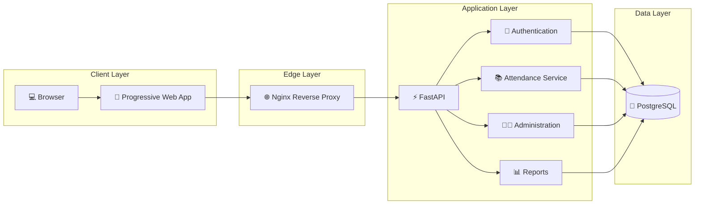
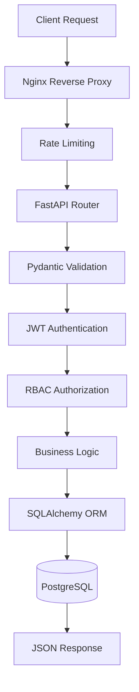
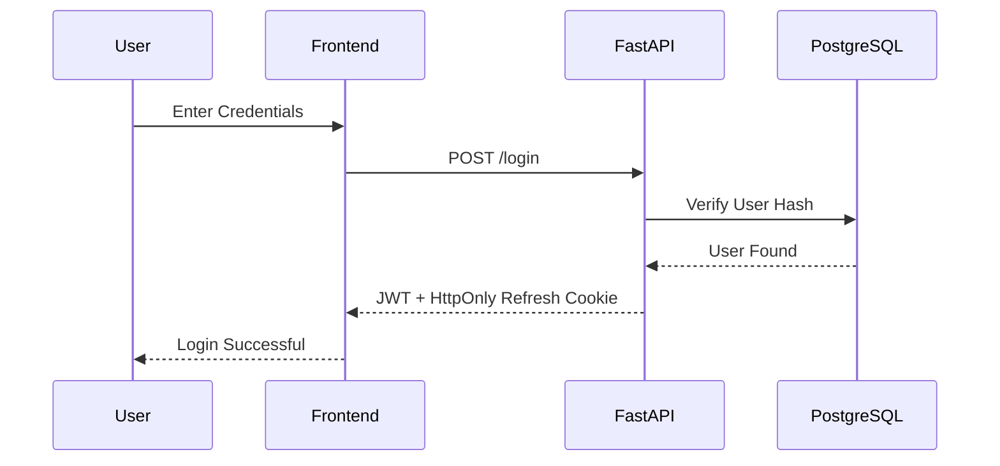
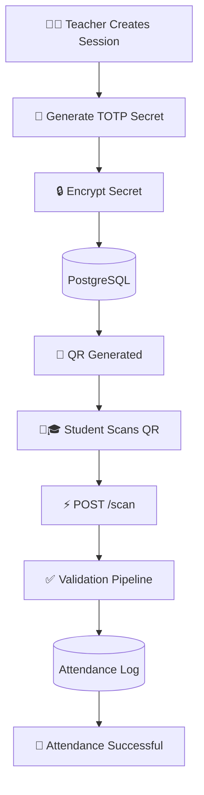
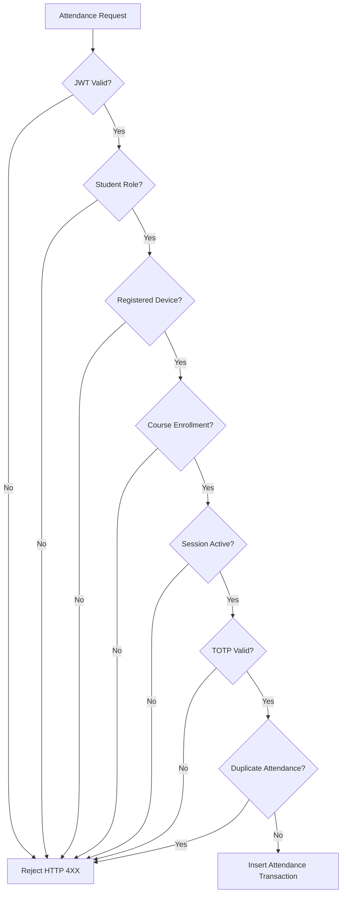
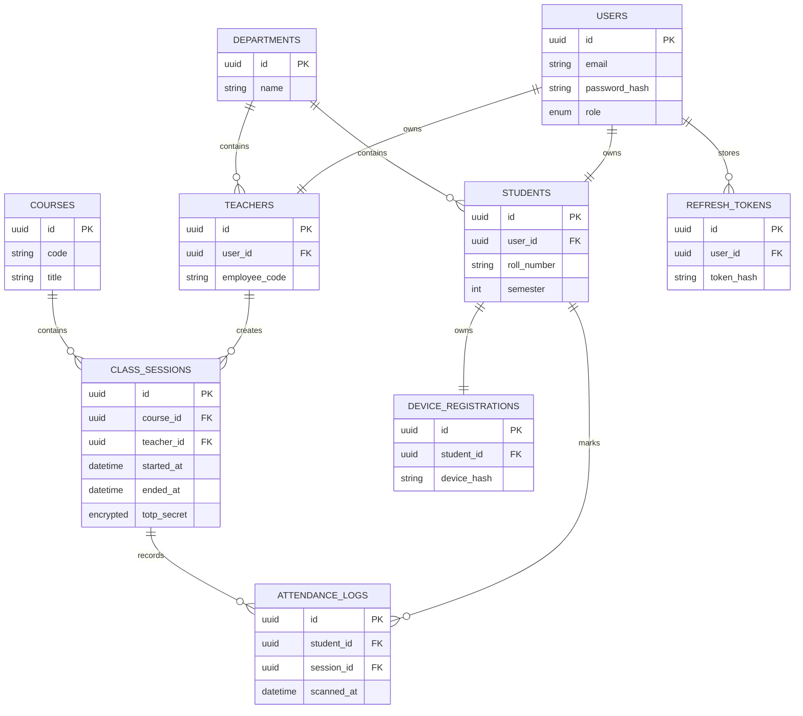
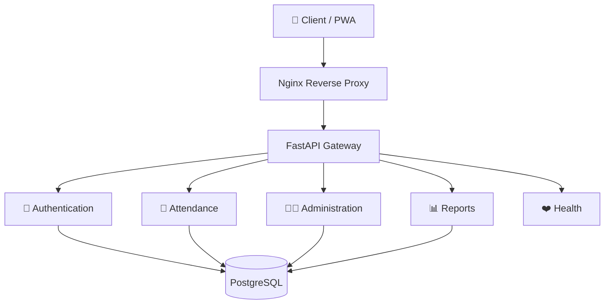

<div align="center">

# 🎓 KNMIET Connect

### Secure Device-Bound Attendance Management Platform

*Modern attendance infrastructure built with FastAPI, PostgreSQL, Docker, and Progressive Web Technologies.*

<br>


---

### 🏫 Eliminate Proxy Attendance with Cryptographic Verification

*A backend-first attendance platform that combines authentication, device registration, role-based authorization, and rotating TOTP verification to make classroom attendance significantly harder to forge.*

</div>

---

## 2. Project Overview

Traditional attendance systems depend on paper registers or static QR codes, both of which are vulnerable to proxy attendance and manual errors.

**KNMIET Connect** modernizes this workflow by introducing a layered verification system where attendance is tied not only to an authenticated user, but also to a registered device and a time-sensitive verification token.

Instead of trusting a single QR code, the system verifies **identity**, **authorization**, **device ownership**, **course enrollment**, and **time-based authentication** before recording attendance. The platform also centralizes attendance management for teachers and administrators through a secure REST API and PostgreSQL-backed data model.

---

## 3. Problem Statement

Universities commonly face several challenges with conventional attendance systems. A single static QR code or paper sheet offers no real verification of physical presence, identity, or authorization. The consequence is widespread proxy attendance, untracked academic records, and high administrative overhead.

---

## 4. Why Existing Solutions Fail

| ❌ Traditional Approach | ⚠️ Architectural Flaw | 🚨 Result |
|-------------------------|------------------------|----------|
| Paper attendance sheets | No data integrity, easily altered | Time-consuming and prone to human error |
| Static QR Codes | Single factor, no time constraint | Easy to photograph and share remotely |
| Simple Login Portals | No hardware verification | Friends can mark attendance for others |
| Manual Record Management | No relational consistency | Difficult auditing and reporting |
| Weak Authentication | No session rotation | Increased risk of unauthorized access |

---

## 5. How KNMIET Connect Solves It

KNMIET Connect introduces multiple independent security layers before attendance is accepted. By separating concerns into identity, hardware validation, and time-based cryptographic checks, it eliminates single points of failure.

```text
                    Student Login
                          │
                          ▼
                 JWT Authentication
                          │
                          ▼
                Role Verification (RBAC)
                          │
                          ▼
              Registered Device Validation
                          │
                          ▼
             Course Enrollment Validation
                          │
                          ▼
          Rotating 30-second TOTP Verification
                          │
                          ▼
             Attendance Recorded Securely
```

Every successful attendance record passes through each validation stage before it is committed to the database. This layered approach significantly reduces common forms of proxy attendance while maintaining a straightforward workflow for legitimate users.

---

## 6. Feature Highlights

| 🚀 Capability | Description |
|--------------|-------------|
| 🔐 Secure Authentication | JWT authentication with HttpOnly refresh token rotation |
| 👥 Role-Based Access Control | Distinct endpoints for Students, Teachers, and Administrators |
| 📱 Device Registration | Cryptographic binding of attendance to registered student devices |
| ⏱️ Dynamic TOTP Verification | 30-second rotating verification codes reduce QR sharing abuse |
| 🗄️ PostgreSQL Backend | Relational schema with strong data integrity and foreign keys |
| ⚡ Async FastAPI | Non-blocking, asynchronous REST API optimized for I/O bounds |
| 🐳 Docker Deployment | Containerized multi-service architecture for reproducible environments |
| 🌐 Progressive Web App | Lightweight installable frontend experience with offline asset caching |
| 📊 Attendance Reporting | Exportable CSV analytics for institutional administration |

---

## 7. Technology Stack

<div align="center">

| Layer | Technologies |
|-------|--------------|
| **Frontend** | Vanilla JavaScript • HTML5 • CSS3 • Progressive Web App |
| **Backend** | FastAPI • Python • SQLAlchemy 2.0 |
| **Database** | PostgreSQL 16 |
| **Infrastructure** | Docker Compose • Nginx |
| **Authentication** | JWT • HttpOnly Cookies • Role-Based Access Control |
| **Security** | Bcrypt • TOTP • Device Binding |
| **Migrations** | Alembic |

</div>

---

## 8. High-Level Architecture

```text
                ┌────────────────────┐
                │     Browser/PWA    │
                └─────────┬──────────┘
                          │
                          ▼
                ┌────────────────────┐
                │       Nginx        │
                │ Reverse Proxy      │
                └─────────┬──────────┘
                          │
                          ▼
                ┌────────────────────┐
                │      FastAPI       │
                │ Business Logic     │
                └─────────┬──────────┘
                          │
                          ▼
                ┌────────────────────┐
                │   PostgreSQL 16    │
                │ Relational Storage │
                └────────────────────┘
```

---

## 9. Complete System Architecture

KNMIET Connect follows a **containerized three-tier architecture** designed around clear separation of responsibilities. Every layer performs a single function, making the system easier to maintain, secure, and scale over time.



---

## 10. Request Lifecycle

Every API request follows a predictable processing pipeline to ensure consistency and security.



| Step | Purpose |
|------|----------|
| 🌐 Nginx | Receives incoming requests and serves static assets. |
| 🚦 Rate Limiting | Prevents abuse of sensitive endpoints such as authentication. |
| 📥 Validation | Ensures request payloads conform to expected schemas. |
| 🔐 Authentication | Verifies the user's identity using JWT credentials. |
| 👥 Authorization | Confirms the user has permission to access the requested resource. |
| ⚙️ Business Logic | Executes attendance, authentication, or administrative operations. |
| 🗄️ Database | Persists validated data using PostgreSQL. |

---

## 11. Authentication Architecture

Security is the foundation of KNMIET Connect. Instead of relying on a single authentication mechanism, every attendance request passes through **multiple independent security layers** before it is accepted.



---

## 12. Security Architecture

Rather than trusting a single security mechanism, KNMIET Connect implements Defense in Depth.

```text
Login
 │
 ▼
JWT Authentication
 │
 ▼
RBAC Middleware
 │
 ▼
Registered Device Hash Check
 │
 ▼
Course Enrollment Validation
 │
 ▼
Valid TOTP Window
 │
 ▼
Database Constraints Check
 │
 ▼
Attendance Recorded
```

An attacker would need to bypass every validation stage, not just one, before an attendance record could be maliciously created.

| Feature | Purpose |
|----------|---------|
| JWT Access Tokens | Authenticate API requests statelessly |
| Refresh Token Rotation | Maintain secure user sessions without exposing long-lived credentials |
| HttpOnly Cookies | Prevent client-side script access to refresh tokens |
| Role-Based Authorization | Enforce least-privilege access across endpoints |
| Device Registration | Bind attendance to a known hardware signature |
| TOTP Verification | Validate real-time physical attendance |
| Audit Logging | Preserve historical accountability at the database level |

---

## 13. Attendance Engine

The Attendance Engine is the core of KNMIET Connect. Its primary mandate is to verify that only an authenticated, authorized, enrolled student using a registered device can successfully mark attendance during an active class session.

---

## 14. Attendance Lifecycle



---

## 15. QR/TOTP Validation Pipeline

This is the heart of the Attendance Engine. Only if **every validation succeeds** does the request proceed to the database transaction.



| Validation | Purpose |
|------------|----------|
| 🔑 JWT Authentication | Confirms user identity |
| 👥 Role Verification | Confirms the requester is a student |
| 📱 Device Registration | Ensures attendance originates from the registered device |
| 🎓 Enrollment Check | Verifies the student belongs to the course |
| 📚 Session Status | Prevents attendance after class has ended |
| ⏱️ TOTP Validation | Confirms QR freshness within 30-second window |
| 🚫 Duplicate Check | Prevents multiple submissions for the same session |

---

## 16. Database Architecture

At the heart of KNMIET Connect lies a relational PostgreSQL database designed to maintain data integrity, enforce relationships, and support secure attendance operations. The system models the academic environment through interconnected entities representing users, departments, courses, attendance sessions, and attendance records.

---

## 17. ER Diagram



---

## 18. Database Design Decisions

The schema follows strict relational design principles to enforce system invariants.

| Principle | Implementation Details |
|-----------|----------|
| 🔗 Foreign Keys | Strict mapping between users, students, sessions, and attendance logs. |
| 🔒 Constraints | Unique composite constraints prevent duplicate attendance entries for the same student-session pair. |
| 📚 Normalization | Identity data is decoupled from academic roles (Student/Teacher tables). |
| ⚡ Indexes | B-Tree indexing on session lookups and user emails for rapid query resolution. |
| 🛡️ Audit Support | Relational structure naturally supports historical tracking without overwriting records. |
| 🔄 Transactions | SQLAlchemy enforces atomic attendance operations to prevent partial inserts. |

---

## 19. REST API Architecture

KNMIET Connect exposes a RESTful API built with **FastAPI**, where each endpoint is organized around a specific domain context. Rather than placing all functionality into a single monolithic router, the API is divided into independent modules.



---

## 20. API Organization

| Domain | Scope of Responsibility |
|---------|----------|
| `/api/auth` | JWT issuance, refresh token rotation, login, logout. |
| `/api/attendance` | Device registration, session creation, QR generation, attendance scanning. |
| `/api/admin` | User management, course assignments, student enrollments, CSV bulk imports. |
| `/api/reports` | Analytics aggregation and CSV data exports. |
| `/api/health` | Container orchestration health checks (liveness, readiness). |

### Example Request: Submitting Attendance
```http
POST /api/scan
Authorization: Bearer <JWT>
Content-Type: application/json

{
    "session_id":"550e8400-e29b-41d4-a716-446655440000",
    "totp":"123456",
    "device_token":"d8b3c9..."
}
```

---

## 21. Infrastructure

KNMIET Connect is built as a **containerized multi-service application**, where each component runs independently while communicating through Docker's internal networking. This provides a reproducible, identical environment across development and staging.

---

## 22. Docker Architecture

```text
                    Docker Host
┌──────────────────────────────────────────────────┐
        Docker Compose Network
┌──────────┐
│  Nginx   │
└────┬─────┘
     │
     ▼
┌──────────────┐
│   FastAPI    │
└──────┬───────┘
       │
       ▼
┌──────────────┐
│ PostgreSQL   │
└──────────────┘
└──────────────────────────────────────────────────┘
```

---

## 23. Deployment Architecture

Nginx acts as the single public entry point, serving static frontend assets and reverse-proxying API traffic to the FastAPI backend. This isolates the internal API service from direct internet exposure.

```text
Internet
 │
 ▼
Port 80 (Nginx)
 │
 ├──── Static Frontend Assets (HTML/CSS/JS)
 │
 └──── /api/*
         │
         ▼
       FastAPI Application (Port 8000)
         │
         ▼
       PostgreSQL Database (Port 5432)
```

---

## 24. Container Communication

Application traffic operates entirely within the internal Docker network. The PostgreSQL database does not expose ports to the host machine in production, strictly limiting network vectors and ensuring data can only be accessed through the FastAPI business logic layer.

---

## 25. Engineering Decisions

Every major technology in KNMIET Connect was selected to solve a specific engineering problem rather than following arbitrary trends.

### Why FastAPI?
- **Async Architecture:** Efficient handling of concurrent I/O operations and database queries.
- **Dependency Injection:** Cleaner, modular middleware for JWT and RBAC.
- **Pydantic Validation:** Strict request/response typing.

### Why PostgreSQL?
- **Relational Integrity:** Attendance systems require strict foreign keys to prevent orphan records.
- **ACID Transactions:** Ensures attendance validation and insertion occur atomically.

### Why a PWA?
- **Zero Install Friction:** Bypasses App Store deployment delays.
- **Cross-Platform:** Runs universally on iOS, Android, and Desktop.

---

## 26. Design Philosophy

```text
Single Responsibility
 │
 ▼
Loose Coupling
 │
 ▼
High Cohesion
 │
 ▼
Layer Separation
 │
 ▼
Dependency Isolation
```

By decoupling the frontend (static PWA), the reverse proxy (Nginx), the logic (FastAPI), and the persistence (PostgreSQL), each tier can be scaled or updated independently without breaking adjacent layers.

---

## 27. Scalability Strategy

The application is currently designed for single-node containerized deployment. However, its stateless backend architecture natively supports horizontal scaling.

```text
Load Balancer
 │
 ├── FastAPI Instance 1
 ├── FastAPI Instance 2
 └── FastAPI Instance 3
       │
       ▼
 Shared PostgreSQL Cluster
```
Because session state is managed via JWTs and HttpOnly database-backed refresh tokens, the FastAPI application can be horizontally scaled without sticky sessions.

---

## 28. Performance Considerations

- **Optimized I/O:** Asynchronous SQLAlchemy queries prevent thread blocking during database operations.
- **Stateless Tokens:** JWT access tokens are validated cryptographically without requiring a database lookup on every request, vastly reducing PostgreSQL load.
- **Nginx Caching:** Static assets are served directly from Nginx, removing load from the Python process.

---

## 29. Security Philosophy

Security is treated as a pipeline, not a checkpoint. The application operates under a Zero Trust assumption—every request must explicitly prove its identity, role, and physical hardware constraints before interacting with the database layer.

---

## 30. Known Limitations

- **No HTTPS Configuration in Compose:** Suitable for development. Production deployments require TLS termination (e.g., via certbot/Nginx or a managed load balancer).
- **Synchronous CSV Processing:** Bulk imports process synchronously and may delay response times for extremely large datasets.
- **No Password Recovery:** Account reset workflows are pending implementation.

---

## 31. Future Roadmap

- 🔐 Implement automated HTTPS via Let's Encrypt in production environments.
- ⚡ Migrate bulk CSV operations to a background task queue (Celery/Redis).
- 📧 Build SMTP integration for password reset workflows.
- 📊 Integrate Prometheus/Grafana for API metrics and observability.
- 🚀 Create Terraform manifests for automated cloud provisioning.

---

## 32. Project Structure

The repository is organized using a layered architecture that separates presentation, business logic, persistence, and infrastructure into independent modules.

```text
knmiet-connect/
│
├── backend/
│   │
│   ├── api/                  # REST API routes
│   ├── core/                 # Configuration & security
│   ├── models/               # SQLAlchemy models
│   ├── schemas/              # Pydantic request/response models
│   ├── services/             # Business logic
│   ├── repositories/         # Data access layer
│   ├── migrations/           # Alembic migrations
│   ├── tests/                # Backend tests
│   └── main.py               # FastAPI entrypoint
│
├── frontend/
│   │
│   ├── css/
│   ├── js/
│   ├── images/
│   ├── service-worker.js
│   └── index.html
│
├── nginx/
│   └── nginx.conf
│
├── docker-compose.yml
├── .env.example
├── README.md
└── LICENSE
```

---

## 33. Quick Start

Getting the application running locally requires a standard Docker toolkit.

```bash
# 1. Clone Repository
git clone https://github.com/Saralfury/knmiet-connect.git
cd knmiet-connect

# 2. Configure Environment
cp .env.example .env

# 3. Build & Start
docker compose up --build
```
Once all containers report healthy status, the application is accessible at `http://localhost:8080`.

---

## 34. Configuration

The application strictly adheres to 12-Factor App principles, loading all configuration from the environment rather than hardcoding constants.

---

## 35. Environment Variables

| Variable | Description |
|-----------|-------------|
| `DATABASE_URL` | PostgreSQL connection string |
| `JWT_SECRET_KEY` | JWT signing secret |
| `FERNET_KEY` | Encryption key for stored TOTP secrets |
| `ACCESS_TOKEN_EXPIRE_MINUTES` | JWT lifetime (minutes) |
| `REFRESH_TOKEN_EXPIRE_DAYS` | Refresh token lifetime (days) |
| `POSTGRES_USER` | Database username |
| `POSTGRES_PASSWORD` | Database password |
| `POSTGRES_DB` | Database name |

---

## 36. Runtime Requirements

| Requirement | Version |
|--------------|---------|
| Python | 3.12+ |
| PostgreSQL | 16+ |
| Docker | Latest Stable |
| Docker Compose | v2+ |
| Modern Browser | Chrome / Edge / Firefox / Safari |

---

## 37. Feature Matrix

| Feature | Status |
|----------|:------:|
| JWT Authentication | ✅ |
| Refresh Tokens | ✅ |
| Role-Based Access Control | ✅ |
| Device Registration | ✅ |
| Attendance Sessions | ✅ |
| Dynamic TOTP QR Codes | ✅ |
| Attendance History | ✅ |
| CSV Import | ✅ |
| CSV Export | ✅ |
| PostgreSQL Audit Logs | ✅ |
| Docker Deployment | ✅ |
| Progressive Web App | ✅ |
| Password Reset | 🚧 |
| HTTPS Deployment | 🚧 |
| Background Queues | 🚧 |

---

## 38. Repository Overview

| Directory | Responsibility |
|------------|----------------|
| 📁 `backend/api` | REST endpoint definitions and routing |
| 📁 `backend/services` | Core domain and business logic |
| 📁 `backend/models` | SQLAlchemy database models |
| 📁 `backend/schemas` | Pydantic request validation schemas |
| 📁 `backend/core` | Cryptography, JWT generation, and configuration |
| 📁 `backend/repositories` | Database abstraction and queries |
| 📁 `backend/migrations` | Alembic database version control |
| 📁 `frontend` | Progressive Web App static source |
| 📁 `nginx` | Reverse proxy and edge routing configuration |

---

## 39. Contributing

Contributions to architectural improvements or feature additions are welcome.
1. Fork the repository.
2. Create a feature branch.
3. Commit your changes logically.
4. Submit a Pull Request outlining the problem and proposed solution.

---

## 40. Acknowledgements

This project was built as a practical exploration of modern backend software engineering, focusing on secure authentication, relational database design, REST API development, and containerized deployment using open-source technologies including FastAPI, PostgreSQL, SQLAlchemy, Docker, and Nginx.

---

## 41. License

This project is licensed under the **MIT License**. See the `LICENSE` file for additional details.

---

## 42. Professional Footer

<div align="center">

## ⭐ If you found this project interesting, consider giving it a star.

### Thanks for taking the time to explore KNMIET Connect!

**Built with ❤️ using FastAPI, PostgreSQL, Docker, and a stubborn refusal to let proxy attendance win.**

</div>
